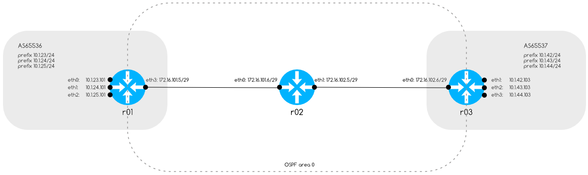

# Simple Routing Test



## Startup, tests and usage

Enter shell

```
docker-compose exec r01 vtysh
```

Start topology

```
docker-compose up -d
```

Show BGP summary

```bash
docker-compose exec r01 vtysh -c "show bgp summary"
docker-compose exec r03 vtysh -c "show bgp summary"
```

Test connectivity

```bash
docker-compose exec r01 ping -c 5 172.16.101.6 # r02
docker-compose exec r01 ping -c 5 172.16.102.5 # r02
docker-compose exec r01 ping -c 5 172.16.102.6 # r03
docker-compose exec r01 ping -c 5 10.1.42.103 # r03. AS 65537 prefix 10.1.42/24
docker-compose exec r01 ping -c 5 10.1.43.103 # r03. AS 65537 prefix 10.1.43/24
docker-compose exec r01 ping -c 5 10.1.44.103 # r03. AS 65537 prefix 10.1.44/24

docker-compose exec r02 ping -c 5 172.16.101.5 # r01
docker-compose exec r02 ping -c 5 172.16.102.6 # r03
docker-compose exec r02 ping -c 5 10.1.23.101 # r01. AS 65536 prefix 10.1.23/24
docker-compose exec r02 ping -c 5 10.1.24.101 # r01. AS 65536 prefix 10.1.24/24
docker-compose exec r02 ping -c 5 10.1.25.101 # r01. AS 65536 prefix 10.1.25/24
docker-compose exec r02 ping -c 5 10.1.42.103 # r03. AS 65537 prefix 10.1.42/24
docker-compose exec r02 ping -c 5 10.1.43.103 # r03. AS 65537 prefix 10.1.43/24
docker-compose exec r02 ping -c 5 10.1.44.103 # r03. AS 65537 prefix 10.1.44/24

docker-compose exec r03 ping -c 5 172.16.102.5 # r02
docker-compose exec r03 ping -c 5 172.16.101.6 # r02
docker-compose exec r03 ping -c 5 172.16.101.5 # r01
docker-compose exec r03 ping -c 5 10.1.23.101 # r01. AS 65537 prefix 10.1.23/24
docker-compose exec r03 ping -c 5 10.1.24.101 # r01. AS 65537 prefix 10.1.24/24
docker-compose exec r03 ping -c 5 10.1.25.101 # r01. AS 65537 prefix 10.1.25/24
```
